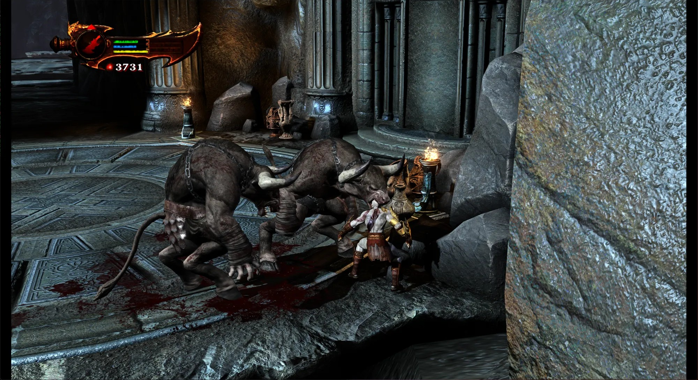
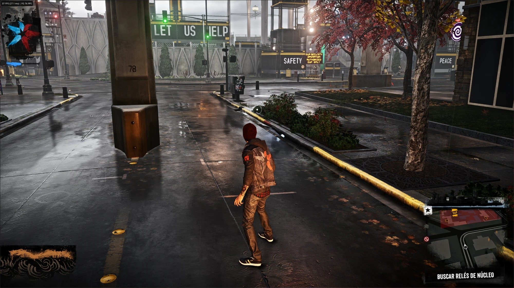
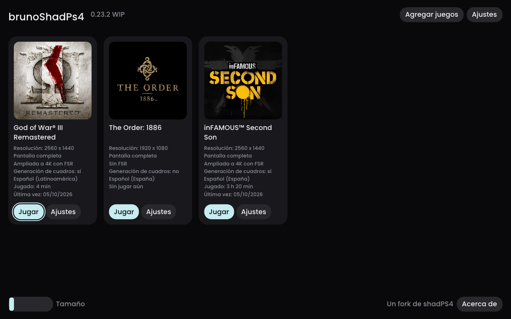
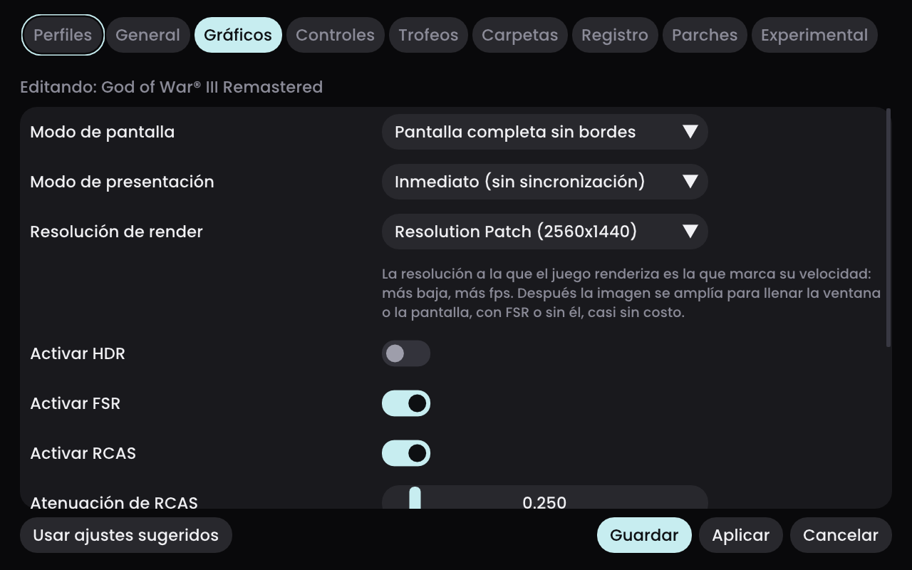
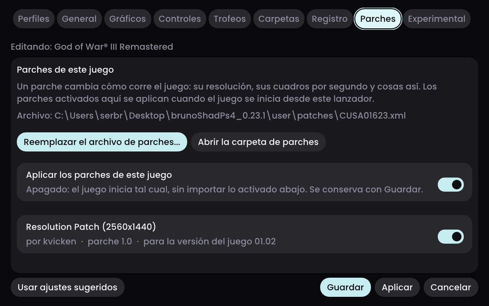
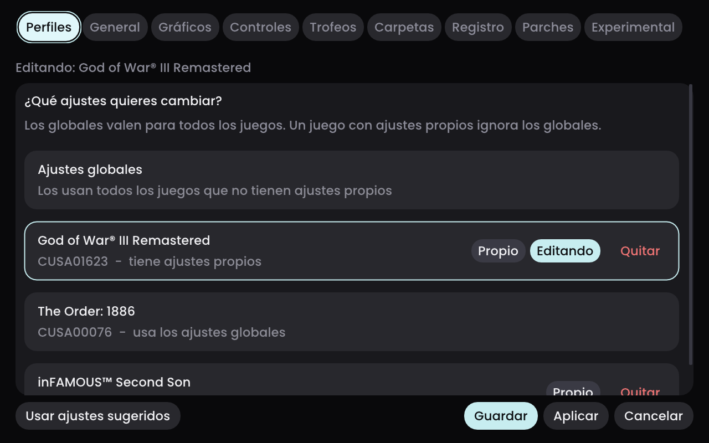
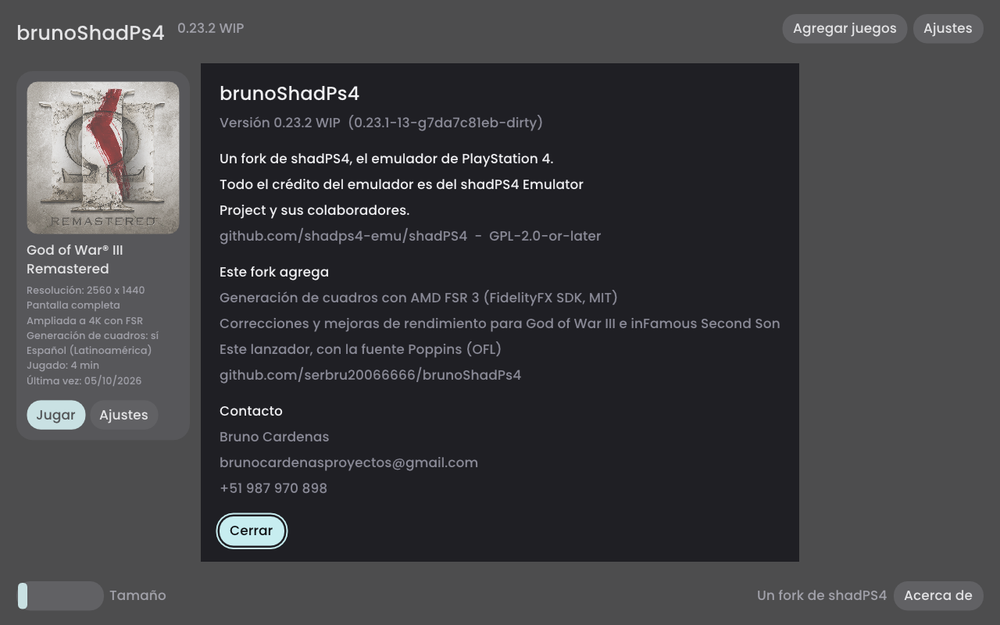

<!--
SPDX-FileCopyrightText: 2026 shadPS4 Emulator Project
SPDX-License-Identifier: GPL-2.0-or-later
-->

<h1 align="center">
   
  <b>brunoShadPs4</b>
   
</h1>

<h1 align="center">
 
</h1>

# Información General

**brunoShadPs4** es un fork del emulador original [shadPS4](https://github.com/shadps4-emu/shadPS4), un emulador temprano de **PlayStation 4** para **Windows**, **Linux** y **macOS** escrito en C++.

Este fork está centrado en integrar mejoras gráficas, correcciones y ajustes específicos para juegos.

### Cambios integrados en este repositorio:
* **God of War III Remastered (Fix)**: Corrección de errores gráficos (líneas/rayas horizontales al renderizar) desactivando de manera forzada el MSAA del host específicamente para este título (CUSA01623 y CUSA01715).
* Ajustes de compilación mejorados y personalizados para SDL sin dependencias rotas de ramas anteriores.

* Antes:
*  

* Despues:
* 

<!-- juegos:inicio -->
### Juegos probados

Probados en Windows con un i7-14700KF y una Radeon RX 6800 XT.

#### God of War III Remastered

* Sin las rayas horizontales que aparecían en sombras, luces y partículas en tarjetas AMD.
* A 1440p con el parche de resolución, FXAA y FSR, con generación de cuadros opcional.
* La captura está tomada con **Realzar la calidad del juego** (Ajustes → Gráficos).
* Los shaders guardados cargan en menos de 6 s al iniciar (antes, cerca de un minuto).

#### inFamous Second Son

* Luz correcta, y efectos de humo y de poderes que antes no se dibujaban, con las lecturas precisas de la GPU.
* Esas lecturas hacían ir el juego a 12–20 fps; servidas desde una copia en memoria del equipo va a 30–44 fps según la zona.
* Generación de cuadros (FSR 3): en la captura, 37 fps del juego mostrados como 76.

#### The Order: 1886

* Jugable desde la versión 0.24.0: entra a la partida y se mantiene en 30 fps, la velocidad original del juego.
* Los objetos (puertas, tuberías, floreros) ya no aparecen y desaparecen en cada cuadro en tarjetas AMD.
* Sin los tirones al moverse: la primera escena pasó de 18 a 30 fps, y el peor cuadro de 733 ms a 34 ms.
* Necesita los ajustes recomendados del lanzador; sin las lecturas de la GPU se queda en negro tras el menú.
<!-- juegos:fin -->

### El lanzador

Al abrir `shadPS4.exe` sin argumentos aparece un lanzador propio, oscuro y en español o inglés. Cada juego dice a qué resolución se dibuja, cómo se muestra, si usa FSR y generación de cuadros, su idioma y cuánto se ha jugado.

* **Generación de cuadros (AMD FSR 3)** integrada en el emulador, con los fps reales y los generados en el indicador.
* **Shaders en segundos**: los shaders guardados se compilan al iniciar en todos los núcleos del procesador (en God of War III, de unos 55 s a menos de 6 s).
* **Ajustes por juego**, con ajustes recomendados para los juegos probados y la resolución de render a elegir.

* **Gestor de parches**: muestra los parches instalados de cada juego, permite activarlos o apagarlos y agregar un archivo de parches.

* **Perfiles**: unos ajustes globales y, encima, los propios de cada juego.

Las versiones compiladas están en [Releases](https://github.com/serbru20066666/brunoShadPs4/releases). El fork se desarrolla y se prueba en **Windows**, y sus versiones compiladas son solo para Windows.

> [!IMPORTANT]
> Este repositorio contiene principalmente el núcleo del emulador (core). Para compilarlo, es posible que necesites las dependencias de Vulkan y SDL3 configuradas adecuadamente en tu entorno.

# Estado
El emulador (y este fork) sigue en etapa de desarrollo activo.

# Licencia
El código original de este proyecto y sus modificaciones están bajo licencia de código abierto de acuerdo al proyecto original.
